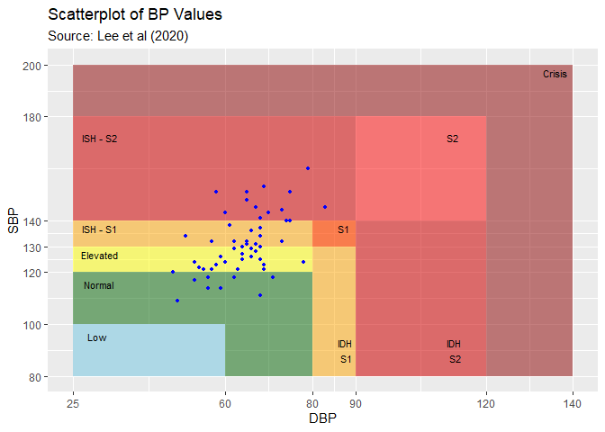

<!-- README.md is generated from README.Rmd. Please edit that file -->

# bp

<!-- badges: start -->

[](https://www.travis-ci.org/johnschwenck/bp)
[](https://ci.appveyor.com/project/johnschwenck/bp)

[](https://cran.r-project.org/package=bp)
[](https://CRAN.R-project.org/package=bp)

<!-- badges: end -->

## bp: Blood Pressure Analysis for R

Cardiovascular disease (CVD) is the leading cause of death worldwide
with Hypertension, specifically, affecting over 1.1 billion people
annually. The goal of the  package is to provide a comprehensive toolbox
for analyzing blood pressure (BP) data using a variety of statistical
metrics and visualizations to bring more clarity to CVD.

### Installation

You can install the released version of bp from
[CRAN](https://CRAN.R-project.org) with:

``` r
install.packages("bp")
```

You can install the development version from
[GitHub](https://github.com/) with:

``` r
# install.packages("devtools")
devtools::install_github("johnschwenck/bp")
```

For installation with vignettes:

``` r
devtools::install_github("johnschwenck/bp", build_vignettes = TRUE)
```

### Sample Data

The  package includes six sample data sets:

  - `bp_hypnos`: The data set contains ABPM measurements from n=
    5subjects with type 2diabetes and obstructive sleep apnea. The
    recordings are taken every hour during the 24-hour period for each
    of the two visits that are 3 months apart. Additional information
    includes sleep/wake indicator for each recording inferred from a
    wrist-worn actigraphy device. The aim of original study (Rooney et
    al.2021) is to determine the effect of positive airway pressure
    treatment of sleep apnea on glycemic control and blood pressure of
    patients with type 2diabetes. The included data is a subset of the
    full data described in [Rooneyet
    al.(2021)](https://clinicaltrials.gov/ct2/show/NCT02454153)
  - `bp_jhs`: The data set consists of HBPM measurements from a [2019
    single-subject pilot
    study](https://dataverse.harvard.edu/dataverse/r4r) during an
    endured aerobic (endurance) exercise: cycling 5,775 miles from New
    York City, New York to Seward, Alaska over the course of 95 days.
    Data was collected using an Omron Evolv wireless blood pressure
    monitor twice per day (in the morning upon waking up and in the
    evening before bed). The aim of original study (Schwenck 2019) is to
    assess blood pressure variability across different environments
    through time.
  - `bp_ghana`: The data set contains HBPM measurements on n=
    757subjects across 32 community health centers from
    cluster-randomized trial in Ghana: 389 subjects are in the health
    insurance coverage (HIC) group and 368 subjects are in another group
    consisting of a combination of HIC with a nurse-led task-shifting
    strategy for hypertension control (TASSH)(this group is denoted
    TASSH + HIC). Baseline blood pressure measurements were collected,
    with 85% of subjects having available 12 month follow-up
    measurements. The aim of original study (Ogedegbe et al.2018) is to
    assess the comparative effectiveness of HIC alone versus the
    combination of TASSH + HIC on reducing systolic blood pressure among
    patients with uncontrolled hypertension in Ghana.
  - `bp_preg`: The data set contains HBPM measurements from n= 209women,
    each of whom were recorded every 30 minutes during the Pregnancy Day
    Assessment Clinic (PDAC) observation window for up to a maximum of
    240 minutes (i.e. a maximum of 8 total readings per subject per
    observation window) in addition to an initial “booking” reading
    before the PDAC assessment. The aim of the original study (McCarthy
    et al.2015) is to investigate the pregnancy-induced hypertension and
    pre-eclampsia prediction to determine whether the blood pressure
    assessment of the first observation window of 1 hour (60 minutes) is
    sufficiently accurate relative to the standard 4 hour (240 minute)
    window.
  - `bp_children`: The data set contains HBPM measurements on n= 1,283
    children from Bristol, UK. Three blood pressure readings per visit
    were collected over the course of two observation periods (at ages 9
    and 11). Additionally, information on their physical activity has
    been collected. The aim of original study (Solomon-Moore et al.2020)
    is to examine how sedentary behavior affect children progressing
    through primary school, and to understand the relationship between
    elevated blood pressure in children and its impact on the
    development of cardiovascular disease into adulthood.
  - `bp_rats`: The data set contains AP measurements sampled at 100 Hz
    of the SS (n1= 9) and SS.13 (n2= 6) genetic strains of Dahl rats.
    Each mouse was administered either a low sodium or a high sodium
    diet. The aim of original study (Bugenhagen et al.2010) is to
    investigate the connection between the dysfunction of the baroreflex
    control system in Dahl rats and salt-sensitive Hypertension

### Intended Functionality

The `bp` package is designed to allow the user to initialize a processed
dataframe through the `process_data` function by specifying any
combination of the following variables present in the user-supplied data
set (with the minimum requirement that `SBP` and `DBP` are included).
The package will then utilize the processed dataframe to calculate
various metrics from medical and statistical literature and provide
visualizations. Perhaps the most useful user-friendly feature of the
package is the ability to generate a visualization report to discern
relationships and assess blood pressure stage progression among
subjects.

The package has the ability to make use of the following physiological
variables (expressed as integers):

  - Systolic Blood Pressure (`SBP`) measured in mmHg
  - Diastolic Blood Pressure (`DBP`) measured in mmHg
  - Arterial Pressure (`AP`) (if applicable)
  - Heart Rate (`HR`) measured in bpm
  - Pulse Pressure (`PP`) measured in mmHg which is calculated as SBP -
    DBP
  - Mean Arterial Pressure (`MAP`) measured in mmHg
  - Rate Pressure Product (`RPP`) which is calculated as SBP multiplied
    by resting HR

There are also processing functionality for arterial pressure (AP) data
which include the following inputs: \* A column corresponding to the AP
data (`AP`) \* Time elapsed (`time_elap`)

Furthermore, there are a suite of processing capabilities within the
`process_data` function such as:

  - `DATE_TIME`: A column coreresponding to a date/time object
    (typically `as.POSIXct` format) such as `12/1/2020 13:42:07`
  - `ID`: Identification of individuals
  - `VISIT`: The visit of each individual, if more than one (integer)
  - `WAKE`: A binary indicator where 1 denotes awake and 0 denotes
    asleep (binary 1 or 0)
  - `GROUP`: An arbitrary column that can be used to group data
    according to this category (such as gender or age)
  - `EOD`: Denotes the end-of-day which can be adjusted for situations
    where individuals may take readings after midnight
  - `DATA_SCREEN`: A screening proceedure to remove outliers based on
    upper and lower limits of BP readings
  - `AGG`: An aggregation option to average consecutive readings taken
    within quick succession
  - `CHRON_ORDER`: Adjust the chronology of the readings (chronological
    vs reverse-chronological)
  - `TZ`: Time zone adjustment

After all available variables are identified and processed, the
resulting processed dataframe is used for all other functions.

Unique to the `bp` package is the ability to create additional columns
that might not originally be present in the supplied data set. At
current, the following additional columns will be created:

  - `TIME_OF_DAY` - Corresponds to the Time of Day (Morning, Afternoon,
    Evening, or Night) based on `DATE_TIME` column
  - `DAY_OF_WEEK` - Corresponds to the Day of the week: a useful column
    for table visuals. Based on `DATE_TIME` column
  - `SBP_CATEGORY` - Systolic Blood Pressure Stages (Low, Normal,
    Elevated, Stage 1, Stage 2, Crisis) as defined by the American Heart
    Association (AHA)
  - `DBP_CATEGORY` - Diastolic Blood Pressure Stages (Low, Normal,
    Elevated, Stage 1, Stage 2, Crisis) as defined by the American Heart
    Association (AHA)
  - `BP_CLASS` - A two-to-one mapping of SBP and DBP readings that
    expands on the original AHA categories using a more recent
    adaptation by (Lee et al 2018)

See examples below for further details.

### Available Metrics

The package will then utilize the above variables to calculate various
metrics from medical and statistical literature in order to quantify and
classify the variability of the readings into their respective
categories of hypertension (normal, elevated, or hypertensive).

The following metrics are currently offered through the `bp` package:

| Function           | Metric Name                                | Source                                                                        |
| ------------------ | ------------------------------------------ | ----------------------------------------------------------------------------- |
| `bp_arv`           | Average Real Variability                   | [Mena et al (2005)](https://doi.org/10.1097/01.hjh.0000160205.81652.5a)       |
| `bp_center`        | Mean and Median                            | [Amaro Lijarcio et al (2006)](https://doi.org/10.1016/j.ejim.2006.07.023)     |
| `bp_cv`            | Coefficient of Variation                   | [Munter et al (2011)](https://doi.org/10.1097/HJH.0b013e32834cf213)           |
| `bp_mag`           | Blood Pressure Magnitude (peak and trough) | [Munter et al (2011)](https://doi.org/10.1097/HJH.0b013e32834cf213)           |
| `bp_range`         | Blood Pressure Range                       | [Levitan et al (2013)](https://doi.org/10.1038/jhh.2013.19)                   |
| `bp_sv`            | Successive Variation                       | [Munter et al (2011)](https://doi.org/10.1097/HJH.0b013e32834cf213)           |
| `bp_sleep_metrics` | Blood Pressure Sleep Metrics               | (Multiple - see documentation)                                                |
| `bp_stages`        | Blood Pressure Stages Classification       | American Heart Association                                                    |
| `bp_stats`         | Aggregation of statistical summaries       | N/A                                                                           |
| `dip_calc`         | Nocturnal Dipping % and Classification     | [Okhubo et al (1997)](https://academic.oup.com/ajh/article/10/11/1201/148906) |

The following visualization functions are currently offered through the
`bp` package:

| Function         | Visualization Type              |
| ---------------- | ------------------------------- |
| `bp_scatter`     | Scatter plot of BP stages       |
| `bp_ts_plots`    | Time series plots               |
| `bp_hist`        | Histograms of BP stages         |
| `dip_class_plot` | Dipping % category plot         |
| `bp_report`      | Exportable report of BP summary |

## Example - HYPNOS data

There are two main steps involved with the `bp` package: The data
processing step and the functionality / analysis step.

1.  Load and process data into a new usable dataframe for all further
    analysis using the `process_data` function

<!-- end list -->

``` r
#devtools::install_github("johnschwenck/bp")
library(bp)

## Load bp_hypnos
data(bp_hypnos)

## Process bp_hypnos
hypnos_proc <- process_data(bp_hypnos, 
                     sbp = 'syst', 
                     dbp = 'diast', 
                     date_time = 'date.time', 
                     hr = 'hr', 
                     pp = 'PP', 
                     map = 'MaP', 
                     rpp = 'Rpp', 
                     id = 'id', 
                     visit = 'Visit', 
                     wake = 'wake')
#> 2 values exceeded the DUL or DLL thresholds and were coerced to NA
```

**NOTE:** the `process_data` function is insensitive to capitalization
of the supplied data column names. For this example, even though the
original column name “SYST” exists in the `bp_hypnos`, “syst” is still
an acceptable name to be given to the function as shown. For emphasis,
all of the above column names were intentionally entered using the wrong
capitalization.

`SBP` and `DBP` must be specified for any other functions to work
properly.

2.  Using the newly processed `hypnos_proc`, we can now calculate
    various metrics. Now that the included raw `bp_hypnos` dataset has
    been processed into `hypnos_proc`, we can now instead rely on this
    new dataframe to calculate various metrics and visualizations. The
    calculation of the nocturnal dipping classification is shown below,
    using a subset of only two of the subjects for comparison (subjects
    70417 and 70435):

<!-- end list -->

``` r
dip_calc(hypnos_proc, subj = c(70417, 70435))
#> [[1]]
#> # A tibble: 8 x 6
#> # Groups:   ID, VISIT [4]
#>   ID    VISIT WAKE  avg_SBP avg_DBP     N
#>   <fct> <fct> <fct>   <dbl>   <dbl> <int>
#> 1 70417 1     0        123.    60.5    10
#> 2 70417 1     1        128     66.6    20
#> 3 70417 2     0        136.    60.5     8
#> 4 70417 2     1        136.    65.6    17
#> 5 70435 1     0        106.    63       6
#> 6 70435 1     1        129.    82.1    23
#> 7 70435 2     0        136.    79.2     9
#> 8 70435 2     1        123.    72.5    20
#> 
#> [[2]]
#> # A tibble: 4 x 6
#> # Groups:   ID [2]
#>   ID    VISIT  dip_sys class_sys  dip_dias class_dias
#>   <fct> <fct>    <dbl> <chr>         <dbl> <chr>     
#> 1 70417 1      0.0359  non-dipper   0.0916 non-dipper
#> 2 70417 2     -0.00450 reverse      0.0784 non-dipper
#> 3 70435 1      0.179   dipper       0.233  extreme   
#> 4 70435 2     -0.104   reverse     -0.0927 reverse
```

In terms of statistical metrics, the `bp_stats` function aggregates many
of the variability and center metrics into one table which makes
comparing the different measures to one another very convenient. Let’s
suppose for this example that we wanted to further analyze these two
subjects by their `BP_CLASS`: we would include `add_groups = "BP_CLASS"`
as an additional argument (note that capitalization does not matter).

``` r
bp_stats(hypnos_proc, subj = c(70417, 70435), add_groups = "bp_class", bp_type = 1)
#> # A tibble: 35 x 16
#> # Groups:   ID, VISIT, WAKE [8]
#>    ID        N VISIT WAKE  BP_CLASS SBP_mean SBP_med    SD   ARV    SV    CV
#>    <fct> <int> <fct> <fct> <ord>       <dbl>   <dbl> <dbl> <dbl> <dbl> <dbl>
#>  1 70417     5 1     0     Normal       114.     114  3.51  3.5   4.74 3.07 
#>  2 70417     3 1     0     Elevated     125.     125  1.53  1.5   1.58 1.22 
#>  3 70417     2 1     0     ISH - S2     143      143  2.83  4     4    1.98 
#>  4 70417     3 1     1     Normal       116.     118  4.04  3.5   4.95 3.49 
#>  5 70417     9 1     1     Elevated     125.     124  2.54  3.25  3.71 2.03 
#>  6 70417     6 1     1     ISH - S1     134.     133  2.42  2.4   2.83 1.81 
#>  7 70417     2 1     1     ISH - S2     144      144  1.41  2     2    0.982
#>  8 70417     3 2     0     Elevated     124      122  4.36  4     5    3.52 
#>  9 70417     2 2     0     ISH - S1     133      133  1.41  2     2    1.06 
#> 10 70417     3 2     0     ISH - S2     151      151  0     0     0    0    
#> # ... with 25 more rows, and 5 more variables: SBP_max <dbl>, SBP_min <dbl>,
#> #   SBP_range <dbl>, Peak <dbl>, Trough <dbl>
```

Here is an example of the `bp_scatter` function for subject 70417:

``` r
bp_scatter(hypnos_proc, subj = 70417)
```


